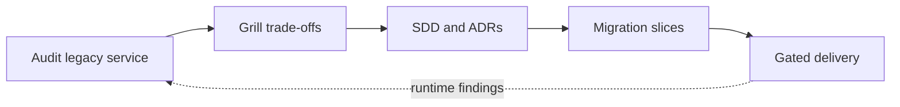

# re-architect

**Architecture discipline for service migrations, delivered as agent skills.**

`re-architect` helps Claude Code, Cursor, and other coding agents inspect a legacy system, force the hard design conversations, write reviewable architecture documents, and plan safe incremental cutovers. Inspired by the small, composable skills approach of [mattpocock/skills](https://github.com/mattpocock/skills). It is a documentation and planning toolkit, not an automatic migration engine.



## The four-step lifecycle

| Step | Skill | Outcome |
| --- | --- | --- |
| Audit | `.claude/skills/audit-service/SKILL.md` | Evidence-backed Current State Assessment: interfaces, stores, events, seams, gaps, risks. |
| Grill | `.claude/skills/grill-architecture/SKILL.md` | Two or three targeted questions per turn; explicit options, decisions, and unresolved blockers. |
| Design | `.claude/skills/to-sdd/SKILL.md` | Draft `docs/architecture/SDD-<service-name>.md` and linked ADRs. |
| Slice | `.claude/skills/to-migration-plan/SKILL.md` | Phased plan and independently deployable ticket specifications, gated by design approval. |

## Install

For agents using the Skills CLI, run from the host repository:

```bash
npx skills add iamujjwalsinha/re-architect
```

Select the skills appropriate to your agent when prompted. The CLI's installation behavior and discovery locations depend on the agent and CLI version; check the resulting skill paths before use. For manual installation, clone this repository and copy the skill folders and templates into your host repository:

```bash
git clone https://github.com/iamujjwalsinha/re-architect.git
mkdir -p my-service/.claude/skills my-service/templates my-service/docs/agents
cp -R re-architect/.claude/skills/. my-service/.claude/skills/
cp -R re-architect/templates/. my-service/templates/
cp re-architect/docs/agents/setup.md my-service/docs/agents/setup.md
```

Merge the guidance in `CLAUDE.md` with any existing host instructions; do not overwrite host rules. Claude Code can invoke `/audit-service`, `/grill-architecture`, `/to-sdd`, and `/to-migration-plan` where project skills are supported. In Cursor or another coding agent, ask it to read the corresponding `SKILL.md` and apply the instructions. Keep `templates/` available to the agent when generating documents.

To recreate this repository's files from one script in an empty directory:

```bash
bash setup-repo.sh ./re-architect
```

## Example: extracting a monolith's billing capability

1. **Audit:** Trace `POST /invoices` from the monolith controller through transaction boundaries, invoice tables, payment provider calls, and `invoice.created` events. The assessment finds that the monolith owns invoice IDs, while a scheduled job retries webhook delivery. Traffic and retry lag remain `Needs runtime confirmation` until measured.
2. **Grill:** Decide whether the new billing service receives shadow reads before routing writes; choose one source of truth during dual writes; establish idempotency keys and a reconciliation query. Agree on canary abort thresholds, recovery authority, and how to handle invoices created after a rollback.
3. **Design:** Write `SDD-billing.md`. Link ADRs for routing ownership and write consistency. Document API/event compatibility, schema expansion, backfill checkpoints, auth propagation, SLOs, and a rollback procedure that accounts for already committed invoices.
4. **Slice:** Instrument invoice divergence and latency first. Shadow requests without side effects, then safely replicate writes if the approved design calls for it. Backfill and reconcile, canary a small traffic share behind a route switch, widen only after observation gates, then retire the old path after the rollback window. Each ticket names a test, metric, stop signal, and recovery owner.

The example is illustrative; the skills require evidence and named approval for a real system. Planning does not authorize production changes.

## Repository map

```text
.claude/skills/{audit-service,grill-architecture,to-sdd,to-migration-plan}/SKILL.md
templates/{SDD_TEMPLATE,ADR_TEMPLATE,MIGRATION_TICKET_TEMPLATE}.md
docs/agents/setup.md
CLAUDE.md
setup-repo.sh
LICENSE
```

## License

MIT. See [LICENSE](LICENSE).
