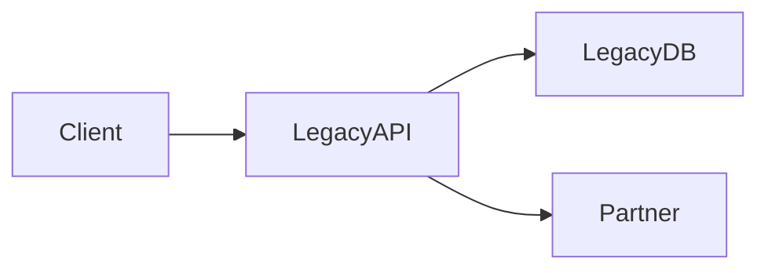
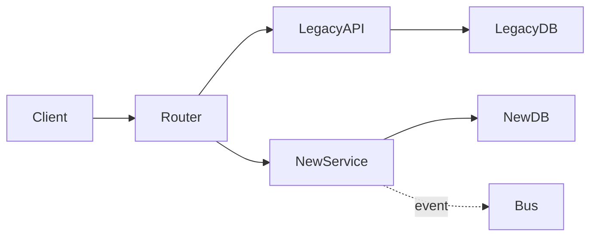

# Solution Design Document: Service migration

**Status:** Draft | **Owner:** Record the accountable team and reviewer | **Last updated:** Record the date | **Related ADRs:** Link the decisions below

> Copy this template to `docs/architecture/SDD-<service-name>.md`. Replace instructional sentences with evidence and decisions. State `Unknown — requires evidence from <owner>` for unresolved facts; do not mark the document approved until reviewers sign off.

## 1. Executive summary

Describe the business objective, affected users and services, migration boundary, expected benefits, non-goals, key risks, and decision requested. Summarize the route to zero downtime and the criteria for stopping safely.

## 2. Scope, evidence, and constraints

Link the Current State Assessment, relevant code paths, dashboards, contract schemas, and incident history. Record the inspected commit and evidence date. State traffic/volume baselines, regulatory constraints, dependencies, assumptions, unknowns, and owners for missing evidence.

## 3. Current and target architecture

Describe where requests enter, which component owns each datum, which calls are synchronous, and which events are asynchronous. Replace the generic labels in both diagrams with actual components and annotate consistency boundaries in prose.

| Capability | Current owner | Target owner | Transition seam | Compatibility requirement |
| --- | --- | --- | --- | --- |
| Describe each capability | Identify the source | Identify the future source | Define how routing changes | State which clients must keep working |

## 4. Functional behavior and contracts

Specify API/RPC operations, auth requirements, request/response schemas, errors, pagination, timeouts, and version negotiation. For each event, specify producer, consumer, schema/version, key, ordering, delivery guarantee, replay, and deduplication. Link schema and contract tests; describe behavior under partial failure.

| Contract | Producer → consumer | Versioning / compatibility | Failure and retry behavior | Test evidence |
| --- | --- | --- | --- | --- |
| Name the interface | Identify both ends | State compatibility rules | Define timeout, retry, and idempotency | Link executable checks |

## 5. Data schema and migration strategy

Identify the system of record at every stage. Record schema changes, data classification, read/write ownership, key mapping, transaction boundaries, retention, and migration tooling. Detail expand/migrate/contract order; dual-write or CDC behavior; backfill pagination and checkpoints; handling of late writes; deduplication and idempotency; reconciliation query and tolerances. Explain how to detect and repair divergence and who can pause the job.

| Dataset | Source → destination | Invariant | Backfill / replay | Reconciliation gate | Recovery owner |
| --- | --- | --- | --- | --- | --- |
| Name a dataset | State both stores | State a testable property | Describe checkpoint and replay | Give measurable threshold and window | Name the accountable role |

## 6. Security and authorization

Describe identity propagation, service authentication, authorization rules, tenant isolation, secret storage and rotation, encryption in transit/at rest, audit logs, PII handling, retention, and threat-model changes. Identify reviewers and verification evidence.

## 7. Operational readiness

Define SLIs/SLOs and error budgets from measured baselines: availability, latency, throughput, queue lag, data divergence, and recovery time. Include dashboards, alert thresholds and owners, tracing/correlation IDs, runbooks, capacity tests, failure isolation, circuit breakers, retries, dead-letter handling, rate limiting, and on-call escalation. Distinguish service SLA from internal SLO.

| Signal | Baseline | Target / gate | Data source | Alert owner |
| --- | --- | --- | --- | --- |
| Name an SLI | Link observed baseline | State numeric target or unresolved decision | Link query or dashboard | Name role |

## 8. Rollout and verification

State Phase 0 instrumentation, Phase 1 shadow or dual-write, Phase 2 canary percentages and observation windows, and Phase 3 retirement. For each stage define entry criteria, compatibility checks, automated and human checks, traffic gate, abort trigger, and authorization to advance. Include contract, load, security, fault, and reconciliation tests.

## 9. Rollback and forward-recovery playbook

For each phase describe the switch, operator, maximum decision time, client impact, state consistency impact, evidence of restored service, and steps for reconciling writes. Identify the first irreversible step and what forward recovery replaces rollback after it. Do not promise a rollback that cannot undo writes or schema deletion.

| Phase | Abort trigger | Route/data action | Verification | Decision owner |
| --- | --- | --- | --- | --- |
| Name phase | Measurable threshold | Specify safe action and replay | Specify service and data checks | Name role |

## 10. Decisions, risks, and approval

Link standalone ADRs for consequential choices. Maintain a risk register with likelihood, impact, mitigation, signal, and owner. List open questions with due dates. Record reviewer names, roles, dates, and approval scope when actually obtained; until then retain `Draft` status.
